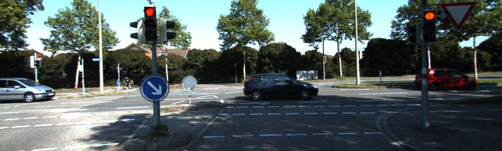
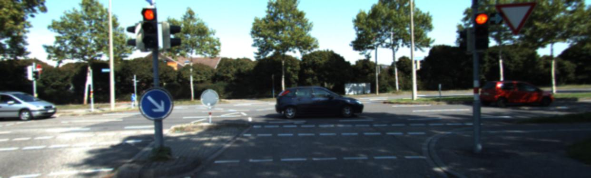

## Visually Imbalanced Stereo Matching

<p float="left">
   
  
</p>


This repository contains code for the paper: [Visually Imbalanced Stereo Matching](https://openaccess.thecvf.com/content_CVPR_2020/papers/Liu_Visually_Imbalanced_Stereo_Matching_CVPR_2020_paper.pdf).

If you find the work useful please consider citing our paper
```
@article{vis_liu_2020,
  title = {Visually Imbalanced Stereo Matching},
  author = {Liu, Yicun and 
  				Ren, Jimmy and 
				Zhang, Jiawei and 
				Liu, Jianbo and 
				Lin, Mude},
  booktitle = {IEEE/CVF Conference on Computer Vision and Pattern Recognition (CVPR)},
  month = {June},
year = {2020}
}
```

## Installation 
The code is built on torch-0.4.0 and torchvision-0.2.0. The code also requires compiling a customized CUDA kernel which is based on cuda-8.0. We encourage you to create a virtual environment with Virtualenv or Anaconda

Once you have cloned the repository, cd to the root directory and  👇

1. Install dependencies.
   ```Shell
   pip install -r requirements.txt 
   ```
   
2. Compile the customized CUDA kernels. The Dynamic Displacement Filter described in the paper is implemented with our own customized kernel. You'll be needing PyTorch 0.4.0 and cuda-8.0.
   ```Shell
   bash install.sh
   ```
   
3. Download pre-trained models of view restoration network from [[GoogleDrive]](https://drive.google.com/drive/folders/1plB6jOGFXLyVkDgQhLZZSR7lX494Rb6Z?usp=sharing) and unzip them under the `Visually-Imabalanced-Stereo` folder. You should expect `KPN.pth` in the root directory.  The models serve as pre-trained models for dynamic filters and pre-trained models to compute the preceptual loss.

4. Optional. Prepare the stereo matching network following instruction at [CRL](https://github.com/Artifineuro/crl). The output of View Synthesis Network will be used for Stereo Matching

## Inferencing a single image
This repository contains a toy KITTI dataset. To run inference for a single pair stereo images. 👇
```
bash run.sh
```
You should expect Average. PSNR and Average. SSIM as your output.

## Reproducing KITTI Results

To produce the experiment results in the paper. You'll need to prepare KITTI Stereo 2015 dataset. You'll need to download the prepared dataset from [[OneDrive]](), or from the official Kitti website. You should perserve your folder sturcture like this:

```
dataset\
   |--data_scene_flow
         |---test
         |---train
```

To reproduce the inference of view synthesis network, 
```
python train.py 
         --only_test 1 
         --input_nc 3 
         --dataset data_scene_flow 
         --gpu_num 1 
         --loss Smooth-L1 
         --batchSize 1 
         --testBatchSize 1 
         --loading_weights 1 
         --scale_factor 2 \
         --filter_size_horizontal 201 
         --filter_size_vertical 0  
         --image_width 1242 
         --image_height 375 
         --weight_source ours
```


